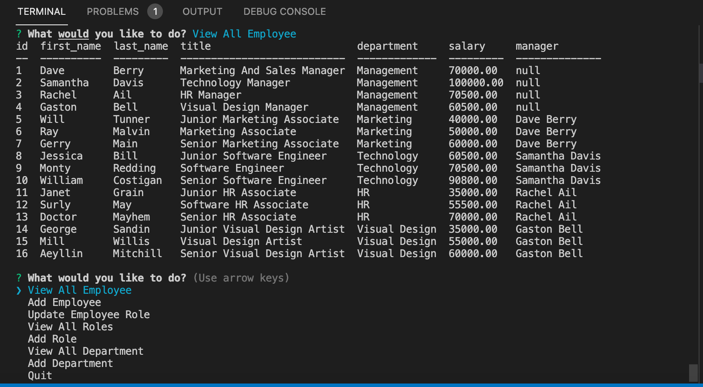

# MySQL Employee Tracker

  [](https://opensource.org/licenses/MIT)

  ## Description
  This application creates a mock employee portal that keeps track of the salary, name and positions of the 
  employees added to the MySQL database. It utilizes the inquirer package to prompt the user for information about the company and the SQL data. This application uses node, MySQL
  and express.

  ## Table of Contents

  * [Installation](#installation)

  * [Usage](#usage)

  * [Visuals](#visuals)

  * [License](#license)

  * [Deployed Links](#deployed-links)

  * [Questions](#questions)


  ## Installation

  To install necessary dependencies, run the following commands:
  ```mysql -u root```

  ```source db/schema.sql ```

  ```source db/seeds.sql```

  ```exit```

  ```npm i```

  ``` npm start ```

  ## Usage

  This DB is not hosted. To use this app make sure to import the schema and seed data from the db folder.  If you have MySQL install run ```mysql -u root```. While in the mySQL shell, run ```source db/schema.sql ``` and then ```source db/seeds.sql```. After this, run ``` npm i ``` and ``` npm start ```.

## Visuals
  

  ## License

  This project is licensed under the MIT license.

## Deployed Links

* [Demo Video](https://watch.screencastify.com/v/dcQ1KhXF4Fc0IHcxTWJd)

* [The URL of the GitHub repository.](https://github.com/simone188535/MySQL-Employee-Tracker)
  ## Questions

  If you have any questions about the repo, open
  an issue or contact me directly at simone.anthony1@yahoo.com. You
  can find more of me at [simone188535](https://github.com/simone188535)
